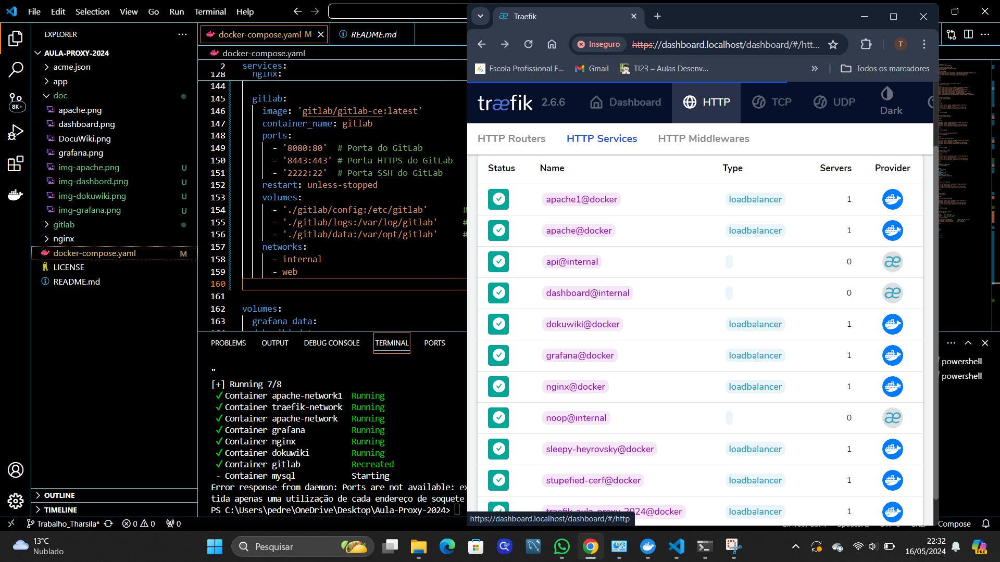

Para aplicar as mudanças solicitadas, as seguintes modificações foram feitas:

Os hosts estavam definidos na linha 28 como dashboard.localhost, 
Na linha 46 como apache.localhost,
na linha 64 como apache1.localhost, 
linha 82 como dokuwiki.localhost 
e linha 97 como grafana.localhost.

Após isso foram atualizados para:

"vitor-traefik.localhost"
 

"vitor-apache.localhost"
 

"vitor-apache1.localhost"
 
  
"vitor-dokuwiki.localhost"

  
e "vitor-grafana.localhost"
