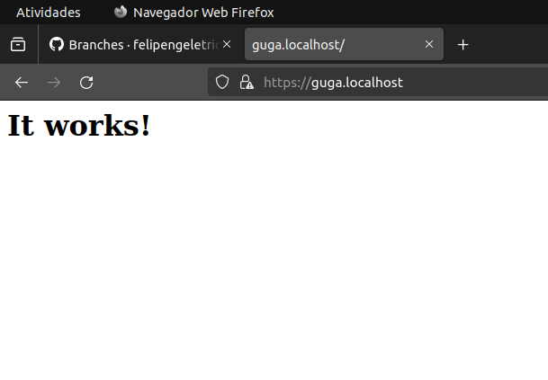
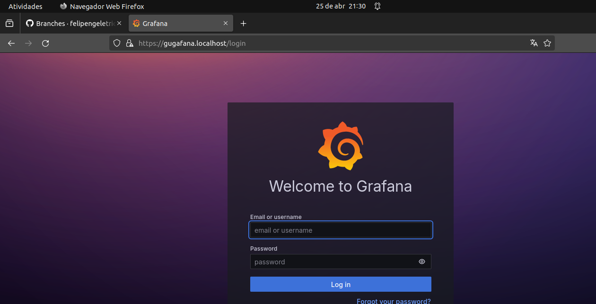
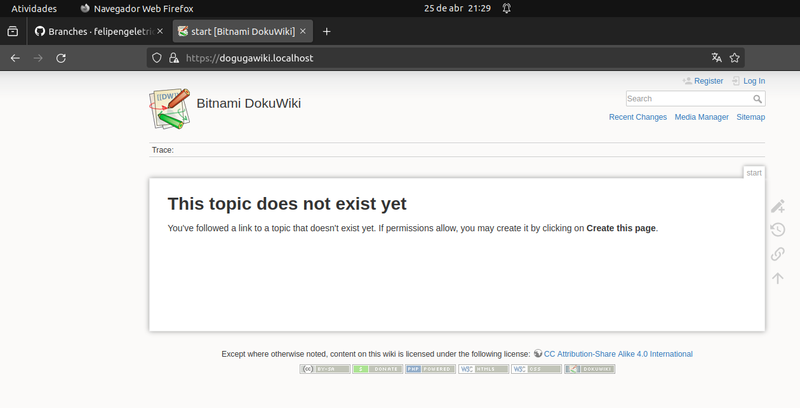
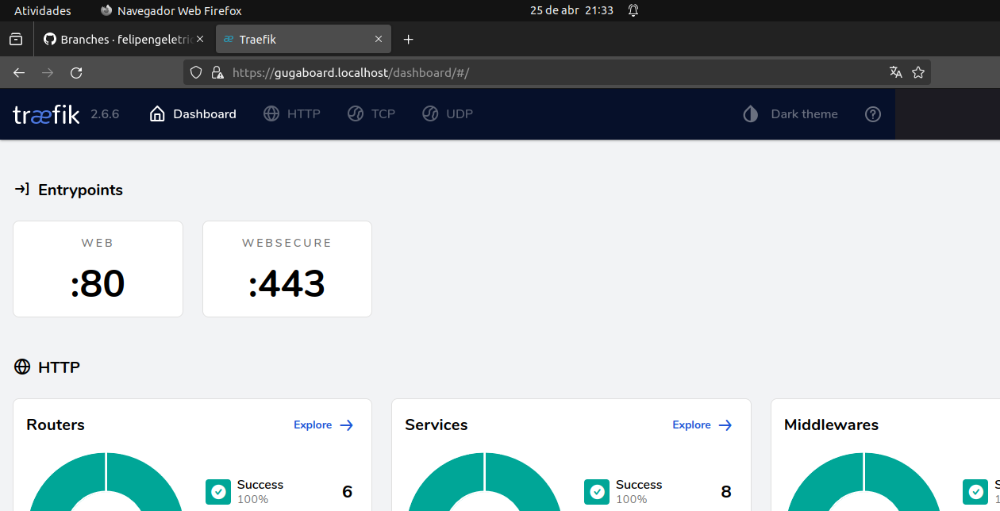
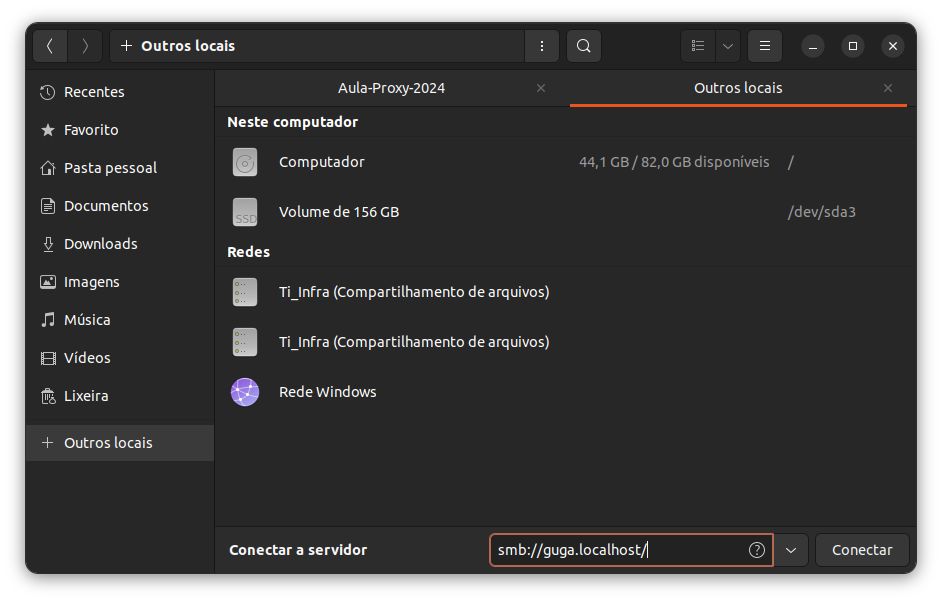
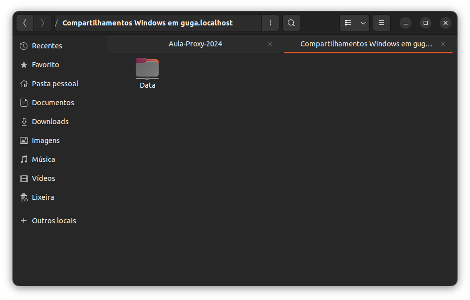

# Projeto PROXY reverso  (DIDÁTICO PARA O USO NAS AULAS DE REDES DE COMPUTADORES)

 Utilizando o Traefik para servidor Apache, Grafana e monitoramento utilizando o dashboard próprio do Traefik.
    
Este projeto utiliza Docker facilitando a implantação (deploy) dos serviços. 
 ***

 ## Implantação dos serviços
 Abrir o terminal e execute os seguintes comandos:

Construindo e excutando os serviços (pressione ctrl+c para cencelar):

> $ docker-compose up --build

Utilize -d para dar um "detach" rodar o serviço na máquina

> $ docker-compose up --build -d

Parando serviços: 
> $ docker-compose stop

Removendo serviços: 
> $ docker-compose rm
***

 ## Testando os serviços

Utilize o navegador web e digite a seguinte url:

> https://guga.localhost/

Depois de acessar o endereço acima aparece a tela conforme abaixo.

 

Neste endereço foi alterado o subdomínio para caracterizar a personalização do serviço com servidor HTTP que poderia ser utilizado para manter um conteúdo ou finalidade específica.

Para testar a personalização do Grafana via docker foi configurado o seguinte subdomínio acessando este subdomínio conseguimos identificar a página do grafana rodando no subdomínio.
 > https://gugafana.localhost/

O Grafana é um sistema versátil, projetado para consultar diversas fontes de dados e fornecer uma plataforma unificada para a visualização e manipulação dessas informações. Com ele, é possível criar visualizações personalizadas e painéis de controle dinâmicos. Neste print indica a configuração padrão deste serviço.

  

O sistema Wiki é muito versátil para documentar online diversos tipos de conteúdos. A personalização do acesso a este serviço pode ser feito pelo endereço seguinte:

  > http://gugawiki.localhost

  

  > http://gugaboard.localhost

  

 Um último serviço rodando neste docker é o Samba. O samba pelo sistema operacional Linux e com o ambiente gráfico Gnome deve ser acessado pelo servidor de arquivos Nautilus. Usando o Nautilus clicamos em Outros e digitamos o enderço configurado no docker-compose neste caso 

  > smb://guga-localhost 

  

  Este endereço permitirá acesso a um volume chamado Data conforme print abaixo.

  
