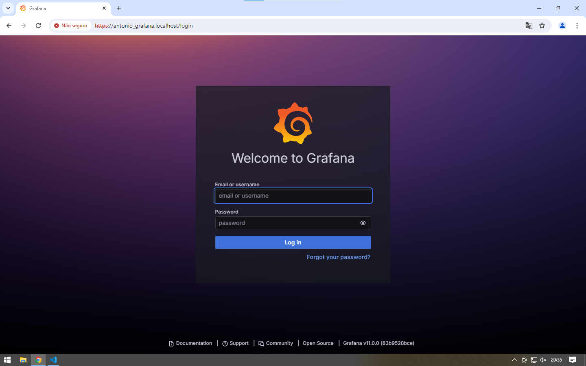
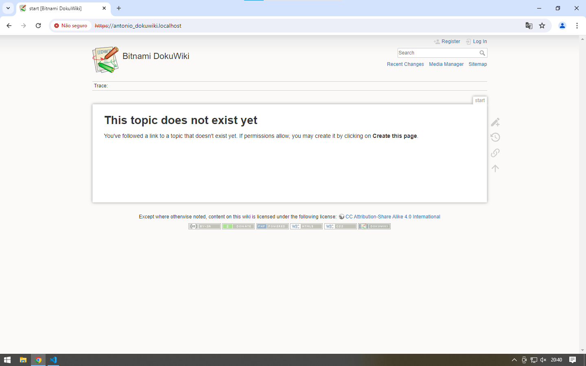
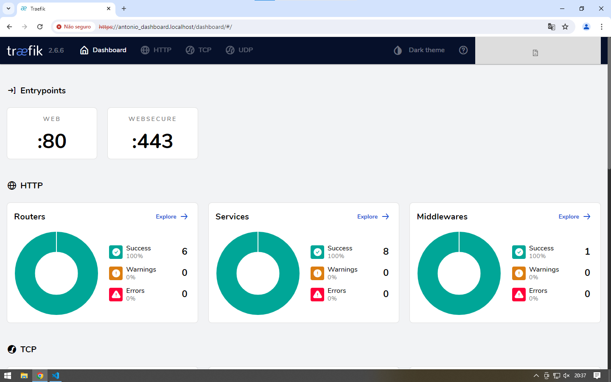

# Projeto PROXY reverso  (DIDÁTICO PARA O USO NAS AULAS DE REDES DE COMPUTADORES)

 Utilizando o Traefik para servidor Apache, Grafana e monitoramento utilizando o dashboard próprio do Traefik.
    
Este projeto utiliza Docker facilitando a implantação (deploy) dos serviços. 
 ***

 ## Implantação dos serviços
 Abrir o terminal e execute os seguintes comandos:

Construindo e excutando os serviços (pressione ctrl+c para cencelar):

 > $ docker-compose up --build

 Utilize -d para dar um "detach" rodar o serviço na máquina

> $ docker-compose up --build -d

Parando serviços: 
> $ docker-compose stop

Removendo serviços: 
> $ docker-compose rm
***

 ## Prints do terminal
 
* Erro em tentar criar a rede
 

* Rede criada

* Serviços rodando
 

 ## Testando os serviços

Utilize o navegador web e digite a seguinte url:

> http://antonio_apache.localhost

 

 > http://antonio_grafana.localhost

 

  > http://antonio_DokuWiki.localhost

  

  > http://antonio_dashboard.localhost

   