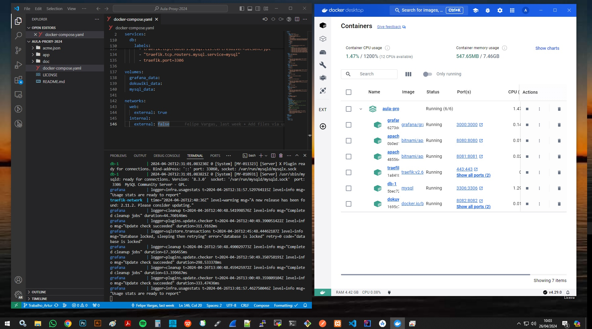
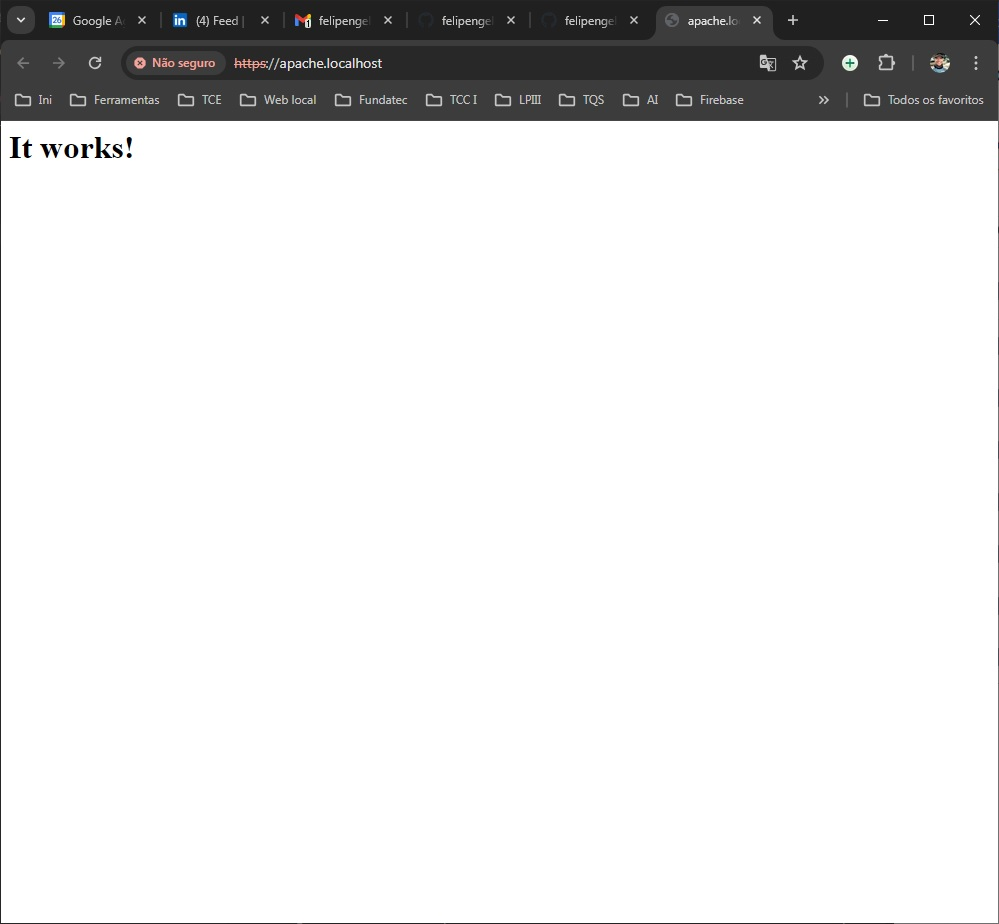
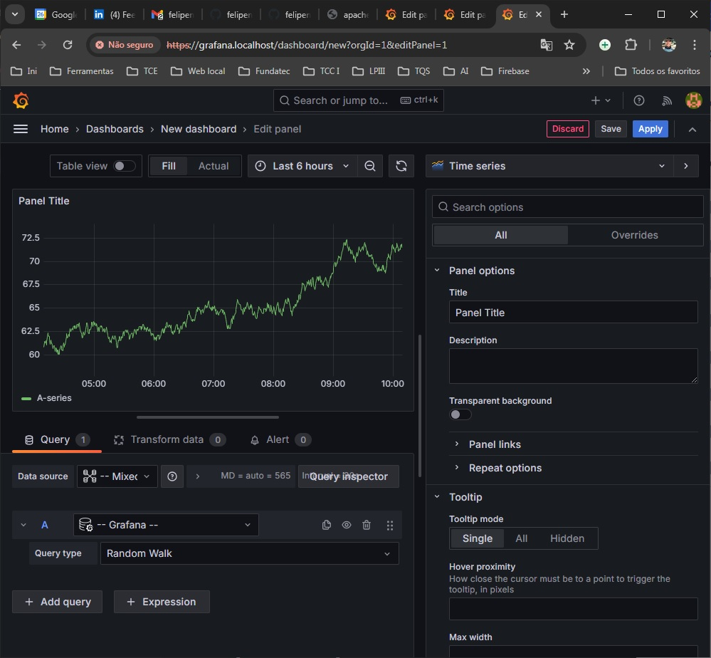
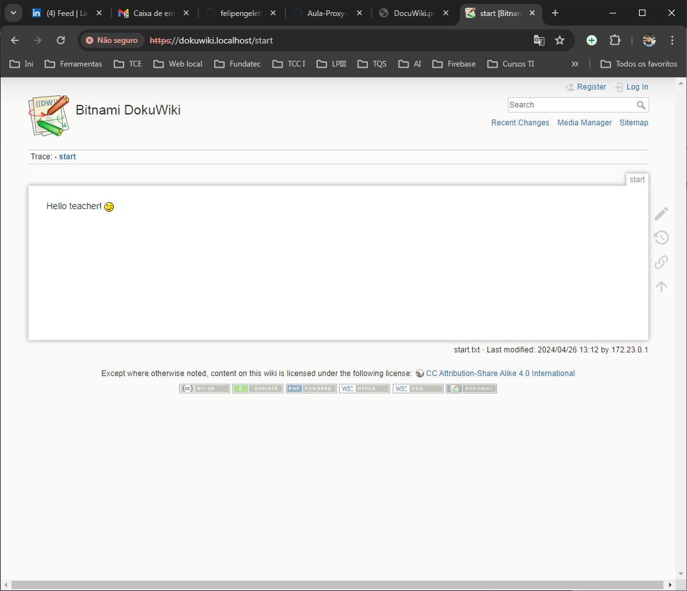
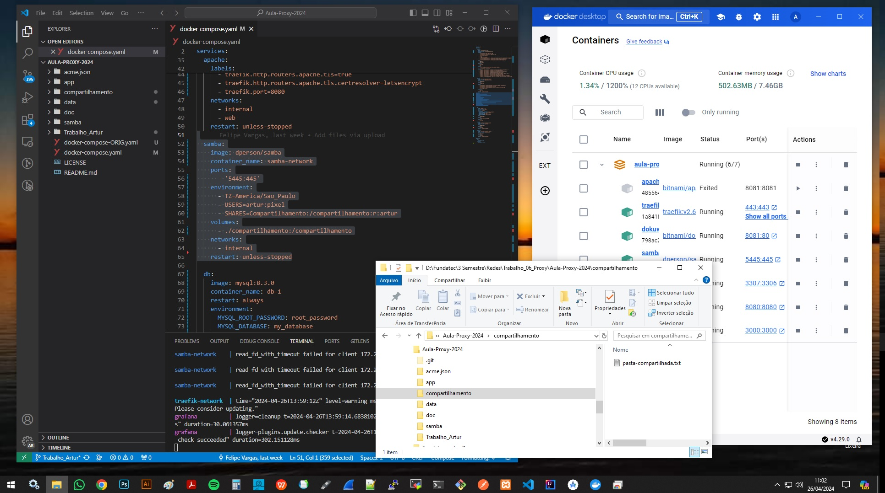
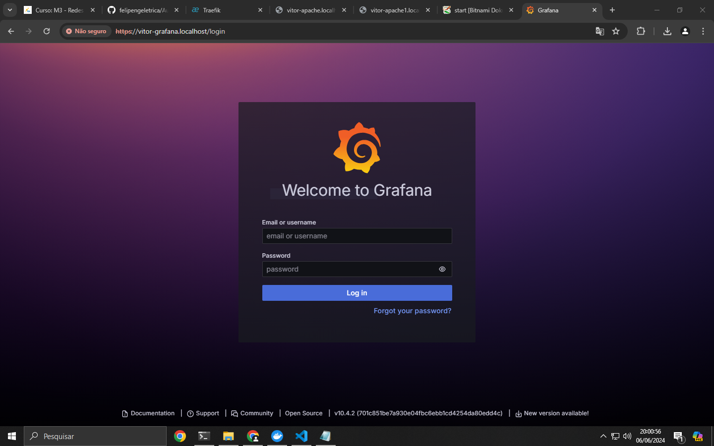
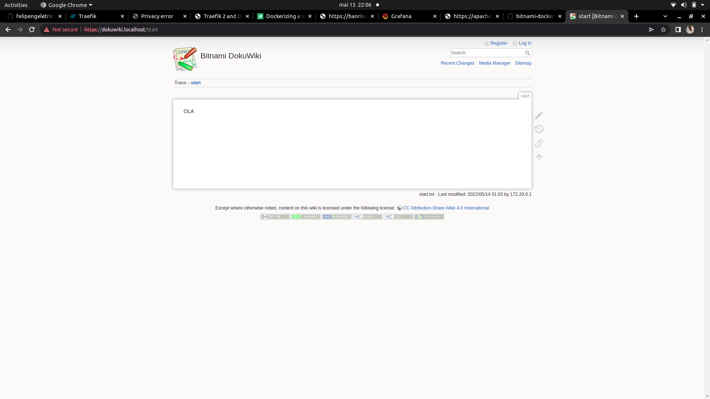
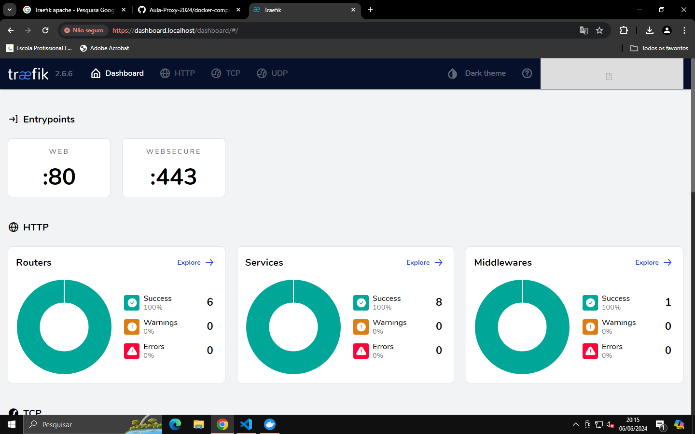

# Projeto PROXY reverso 
# (DIDÁTICO PARA O USO NAS AULAS DE REDES DE COMPUTADORES)

Utilizando o Traefik para servidor Apache, Grafana e monitoramento utilizando o dashboard próprio do Traefik.
    
Este projeto utiliza Docker facilitando a implantação (deploy) dos serviços.


#### Aluno: Artur Bazzanella Christmann
#### Professor: Felipe Vargas
#### Turma: TI23

### Sobre o trabalho

Documente com print e coloque aqui as respostas.

TODO, Documentação e Print Screm das imagens executadas no Docker.

***

---

## Passo a passo para configurar o ambiente Docker

### 1. Instalar o Docker no Windows

1. Baixe o Docker Desktop para Windows no [site oficial](https://www.docker.com/products/docker-desktop).
2. Execute o instalador e siga as instruções na tela.
3. Após a instalação, reinicie o computador.
4. Abra o Docker Desktop para confirmar que ele está funcionando corretamente.

### 2. Configurar o arquivo `docker-compose.yaml`

Crie um arquivo chamado `docker-compose.yaml` no diretório de sua preferência com o seguinte conteúdo:

```yaml
version: '3'
services:

  traefik:
    image: "traefik:v2.6.6"
    container_name: "traefik-network"
    command:
      - --entrypoints.web.address=:80
      - --entrypoints.websecure.address=:443
      - --providers.docker
      - --api
      - --log.level=DEBUG
      - --certificatesresolvers.letsencrypt.acme.email=felipeng.eletrica@gmail.com
      - --certificatesresolvers.letsencrypt.acme.storage=/acme.json
      - --certificatesresolvers.letsencrypt.acme.tlschallenge=true
    ports:
      - "80:80"
      - "443:443"
    networks:
      - internal
      - web
    volumes:
      - "/var/run/docker.sock:/var/run/docker.sock:ro"
      - "./acme.json:/acme.json"
    labels:
      - "traefik.http.routers.traefik.rule=Host(`dashboard.localhost`)"
      - "traefik.http.routers.traefik.service=api@internal"
      - "traefik.http.routers.traefik.tls.certresolver=letsencrypt"
      - "traefik.http.routers.traefik.entrypoints=websecure"
      - "traefik.http.routers.http-catchall.rule=hostregexp(`{host:.+}`)"
      - "traefik.http.routers.http-catchall.entrypoints=web"
      - "traefik.http.routers.http-catchall.middlewares=redirect-to-https"
      - "traefik.http.middlewares.redirect-to-https.redirectscheme.scheme=https"

  apache:
    image: 'bitnami/apache:latest'
    container_name: apache-network
    ports:
      - '8080:8080'
    volumes:
      - ./app:/app
    labels:
      - traefik.http.routers.apache.rule=Host(`apache.localhost`)
      - traefik.http.routers.apache.tls=true
      - traefik.http.routers.apache.tls.certresolver=letsencrypt
      - traefik.port=8080
    networks:
      - internal
      - web
    restart: unless-stopped

  samba:
    image: dperson/samba
    container_name: samba-network
    ports:
      - '5445:445'
    environment:
      - TZ=America/Sao_Paulo
      - USERS=artur:pixel
      - SHARES=Compartilhamento:/compartilhamento:r:artur
    volumes:
      - ./compartilhamento:/compartilhamento
    networks:
      - internal
    restart: unless-stopped

  db:
    image: mysql:8.3.0
    container_name: db-1
    restart: always
    environment:
      MYSQL_ROOT_PASSWORD: root_password
      MYSQL_DATABASE: my_database
      MYSQL_USER: my_user
      MYSQL_PASSWORD: my_password
    ports:
      - "3307:3306"
    volumes:
      - ./data:/var/lib/mysql
    networks:
      - internal

  grafana:
    image: grafana/grafana:latest
    container_name: grafana
    ports:
      - "3000:3000"
    networks:
      - internal
    restart: unless-stopped

  dokuwiki:
    image: bitnami/dokuwiki:latest
    container_name: dokuwiki-1
    ports:
      - "8081:80"
    networks:
      - internal
    restart: unless-stopped

networks:
  web:
    external: true
  internal:
    external: false

```
### 3. Rodar os containers com Docker Compose

# 1. Abra o terminal do Windows (PowerShell ou CMD).
# 2. Navegue até o diretório onde você salvou o arquivo docker-compose.yaml.
# 3. Execute o comando: docker-compose up -d


### 4. Verificar se os serviços estão rodando

Você pode verificar se os serviços estão rodando corretamente acessando os seguintes URLs no seu navegador:

#### Traefik Dashboard: http://dashboard.localhost
#### Apache: http://apache.localhost:8080
#### Grafana: http://localhost:3000
#### Dokuwiki: http://localhost:8081

### 5. Documentação com prints

#### Docker com imagem dos serviços: Apache, Grafana, Dokuwiki, Traefik, DB e Samba.

#### Resposta 1:

Docker com imagem dos serviços: Apache, Grafana, Dokuwiki, Traefik, DB e Samba.

#### Print Screem:



#### Resposta 2:

Apache.

#### Print Screem:



#### Resposta 3:

Grafana.

#### Print Screem:



#### Resposta 4:

Traefik.

#### Print Screem:


#### Resposta 5:

Dokuwiki.

#### Print Screem:



#### Resposta 6:

Samba.

#### Print Screem:




## Thanks Teacher! ;-)


 ***

 ## Implantação dos serviços
 Abrir o terminal e execute os seguintes comandos:

Construindo e excutando os serviços (pressione ctrl+c para cencelar):

 > $ docker-compose up --build

 Utilize -d para dar um "detach" rodar o serviço na máquina

> $ docker-compose up --build -d

Parando serviços: 
> $ docker-compose stop

Removendo serviços: 
> $ docker-compose rm
***

 ## Testando os serviços

Utilize o navegador web e digite a seguinte url:

> http://apache.localhost

  

 > http://grafana.localhost

  

  > http://dashboard.localhost

  

  > http://dashboard.localhost

  
