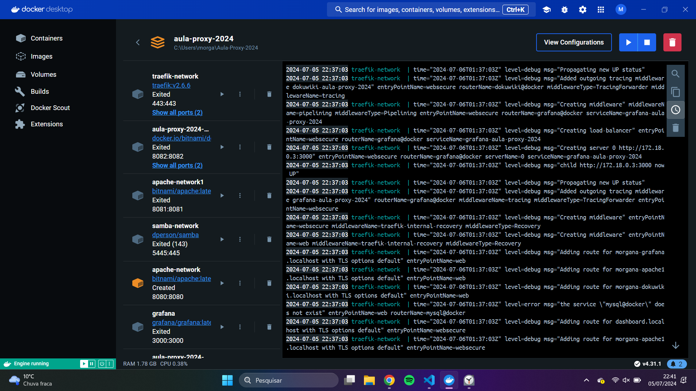
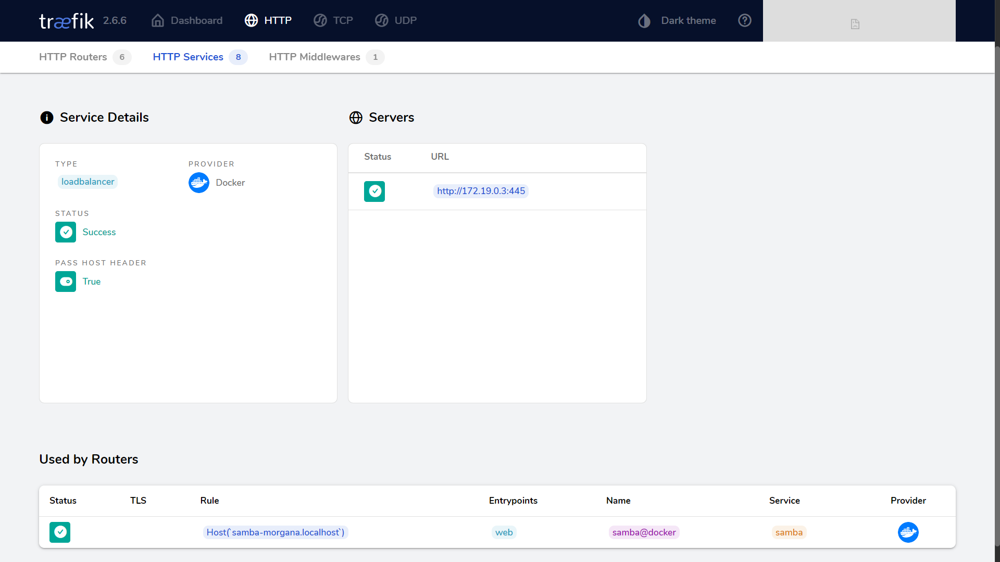
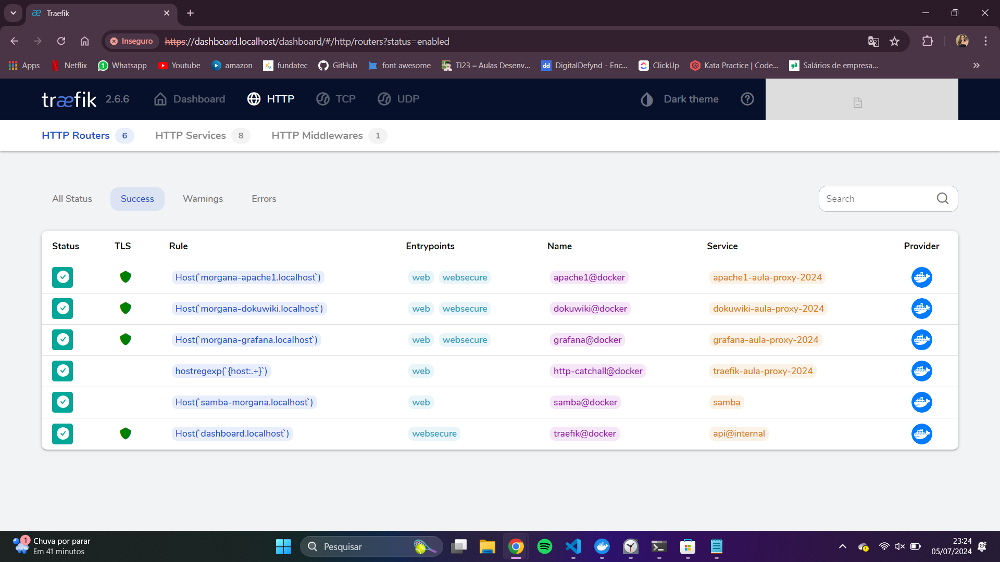
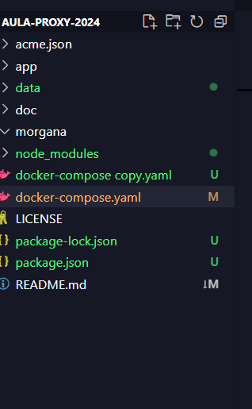

## Trabalho Final

# Configuração de Samba com Traefik como Proxy Reverso

Este guia passo a passo descreve como configurar um servidor Samba acessível através de um subdomínio específico utilizando o Traefik como proxy reverso e Docker Compose.

## Pré-requisitos

1. Docker instalado na sua máquina.
2. Docker Compose instalado na sua máquina.
3. Acesso à internet para baixar imagens de contêiner.

## Passo 1: Criar o Arquivo `docker-compose.yml`

Crie um arquivo chamado `docker-compose.yml` com o seguinte conteúdo:

```yaml
version: '3'

services:
  traefik:
    image: "traefik:v2.6.6"
    container_name: "traefik-network"
    command:
      - --entrypoints.web.address=:80
      - --entrypoints.websecure.address=:443
      - --providers.docker
      - --api
      - --log.level=DEBUG
      - --certificatesresolvers.letsencrypt.acme.email=seu-email@example.com
      - --certificatesresolvers.letsencrypt.acme.storage=/acme.json
      - --certificatesresolvers.letsencrypt.acme.tlschallenge=true
    ports:
      - "80:80"
      - "443:443"
    networks:
      - internal
      - web
    volumes:
      - "/var/run/docker.sock:/var/run/docker.sock:ro"
      - "./acme.json:/acme.json"
    labels:
      - "traefik.http.routers.traefik.rule=Host(`dashboard.localhost`)"
      - "traefik.http.routers.traefik.service=api@internal"
      - "traefik.http.routers.traefik.tls.certresolver=letsencrypt"
      - "traefik.http.routers.traefik.entrypoints=websecure"
      - "traefik.http.routers.http-catchall.rule=hostregexp(`{host:.+}`)"
      - "traefik.http.routers.http-catchall.entrypoints=web"
      - "traefik.http.routers.http-catchall.middlewares=redirect-to-https"
      - "traefik.http.middlewares.redirect-to-https.redirectscheme.scheme=https"

  apache:
    image: 'bitnami/apache:latest'
    container_name: apache-network
    ports:
      - '8080:8080'
    volumes:
      - ./app:/app
    labels:
      - "traefik.enable=true"
      - "traefik.http.routers.apache.rule=Host(`morgana-apache.localhost`)"
      - "traefik.http.routers.apache.entrypoints=websecure"
      - "traefik.http.routers.apache.tls.certresolver=letsencrypt"
      - "traefik.http.services.apache.loadbalancer.server.port=8080"
    networks:
      - internal
      - web
    restart: unless-stopped

  samba:
    image: dperson/samba
    container_name: samba
    ports:
      - '5445:445'
    environment:
      - TZ=America/Sao_Paulo
      - USERS=morgana:78945612
      - SHARES=morgana:/mount:r:w:morgana
    volumes:
      - /caminho/para/compartilhamento:/mount
    labels:
      - "traefik.enable=true"
      - "traefik.http.routers.samba.rule=Host(`samba.morgana.localhost`)"
      - "traefik.http.routers.samba.entrypoints=websecure"
      - "traefik.http.routers.samba.tls.certresolver=letsencrypt"
      - "traefik.http.services.samba.loadbalancer.server.port=445"
    networks:
      - internal
      - web
    restart: unless-stopped

  db:
    image: mysql:8.3.0
    container_name: db-1
    restart: always
    environment:
      MYSQL_ROOT_PASSWORD: root_password
      MYSQL_DATABASE: my_database
      MYSQL_USER: my_user
      MYSQL_PASSWORD: my_password
    ports:
      - "3307:3306"
    volumes:
      - ./data:/var/lib/mysql
    networks:
      - internal

  grafana:
    image: grafana/grafana:latest
    container_name: grafana
    ports:
      - "3000:3000"
    networks:
      - internal
    restart: unless-stopped

  dokuwiki:
    image: bitnami/dokuwiki:latest
    container_name: dokuwiki-1
    ports:
      - "8081:80"
    networks:
      - internal
    restart: unless-stopped

networks:
  web:
    external: true
  internal:
    external: false 
```
## Passo 2:     
Usar o seguinte comando no terminal, para criar o Docker:
docker-compose up -d

Imagem do Docker:



## Passo 3:
Entre nesse link:
dashboard.localhost




## Passo 4:
Verificar se uma pasta foi criada:




