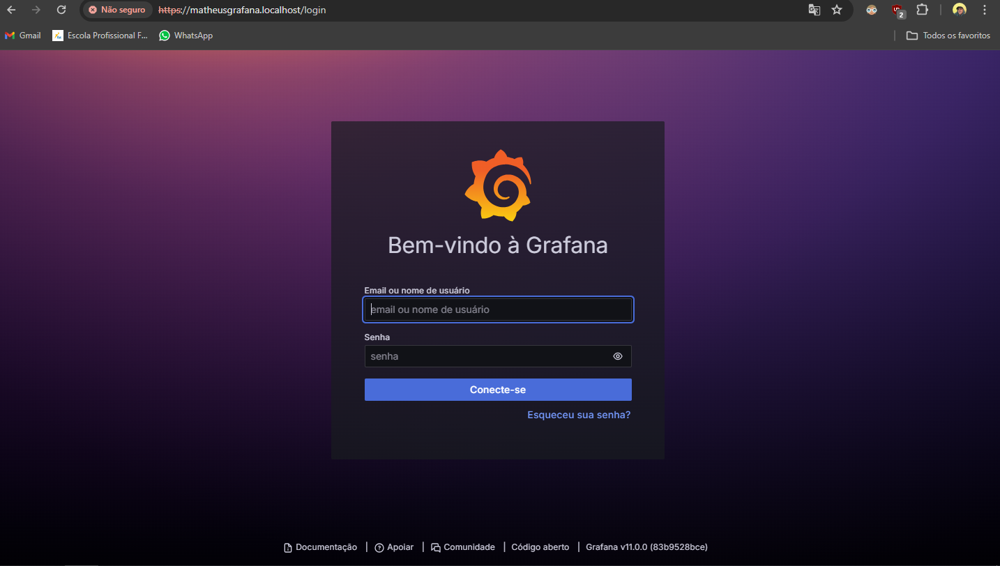
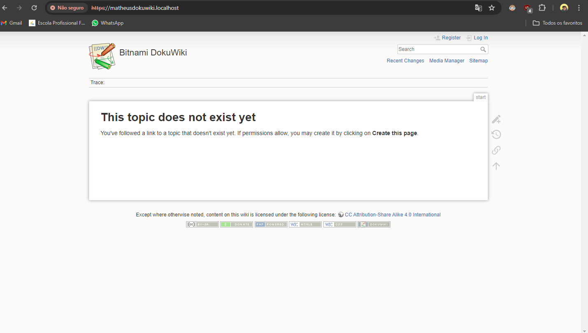
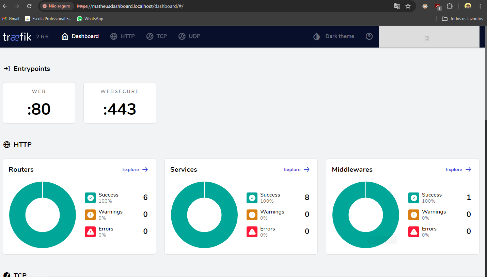

# Projeto PROXY reverso  (DIDÁTICO PARA O USO NAS AULAS DE REDES DE COMPUTADORES)
Primeiro passo foi abrir o terminal para clonar o código ao meu Vs code, executando os seguintes códigos
( git clone https://github.com/felipengeletrica/Aula-Proxy-2024.git),
(cd Aula-Proxy-2024),
(docker-compose up --build).
Este passo a passo foi ultilizado somente para clonar para o meu Vs code.

Após, instalei o Docker Desktop na minha maquina.

 ## Implantação dos serviços
 Abra o terminal e execute os seguintes comandos:

Construindo e excutando os serviços (pressione ctrl+c para cencelar):

 > $ docker-compose up --build

 Utilize -d para dar um "detach" rodar o serviço na máquina

> $ docker-compose up --build -d

Parando serviços: 
> $ docker-compose stop

Removendo serviços: 
> $ docker-compose rm

Na implantação dos serviços e fazendo o passo a passo dos códigos acima ocrreu o seguinte erro
(network web declared as external, but could not be found),
que foi corrigido da seguinte forma (docker network create web), é utilizado para criar uma nova rede personalizada chamada web. Este comando estabelece um ambiente de rede isolado onde contêineres podem se comunicar entre si.
***

Após, acessei cada localhost, para fazer a captura de tela de cada um deles, e a cada aceesso de localhost, era necessário abrir o terminal do próprio Vs code, e rodar os seguintes códigos 
(docker-compose stop), (docker-compose up --build -d).

