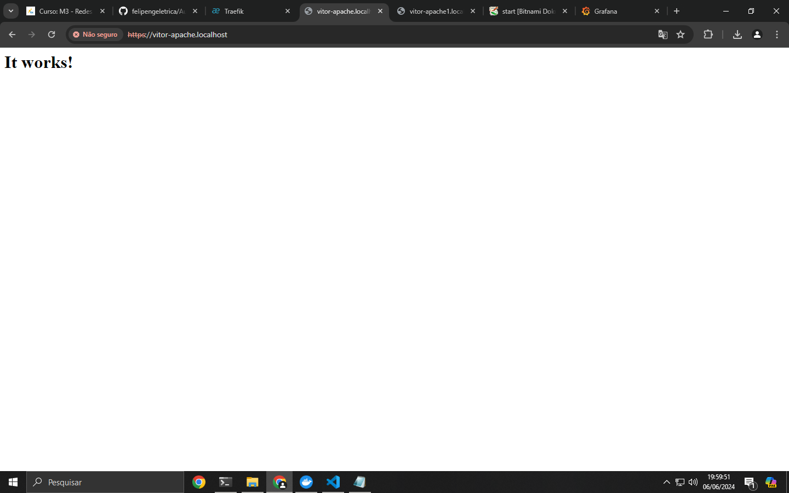

 # Projeto PROXY reverso  (DIDÁTICO PARA O USO NAS AULAS DE REDES DE COMPUTADORES)

 Utilizando o Traefik para servidor Apache, Grafana e monitoramento utilizando o dashboard próprio do Traefik.
    
Este projeto utiliza Docker facilitando a implantação (deploy) dos serviços. 
 ***

 ## Implantação dos serviços
 Abrir o terminal e execute os seguintes comandos:

Construindo e excutando os serviços (pressione ctrl+c para cencelar):

 > $ docker-compose up --build

 Utilize -d para dar um "detach" rodar o serviço na máquina

> $ docker-compose up --build -d

Parando serviços: 
> $ docker-compose stop

Removendo serviços: 
> $ docker-compose rm
***
 

 
 > https://diogo-apache.localhost/

> https://diogo-grafana.localhost/login
 [Grafana](doc/grafana.png)

 > https://diogo-dokuwiki.localhost/
 [DocuWiki](doc/docuwiki.png)

 > https://dashboard.localhost/dashboard/#/
 [Trafik](doc/dashboard.png)

 > Docker
[Docker](doc/docker.png)