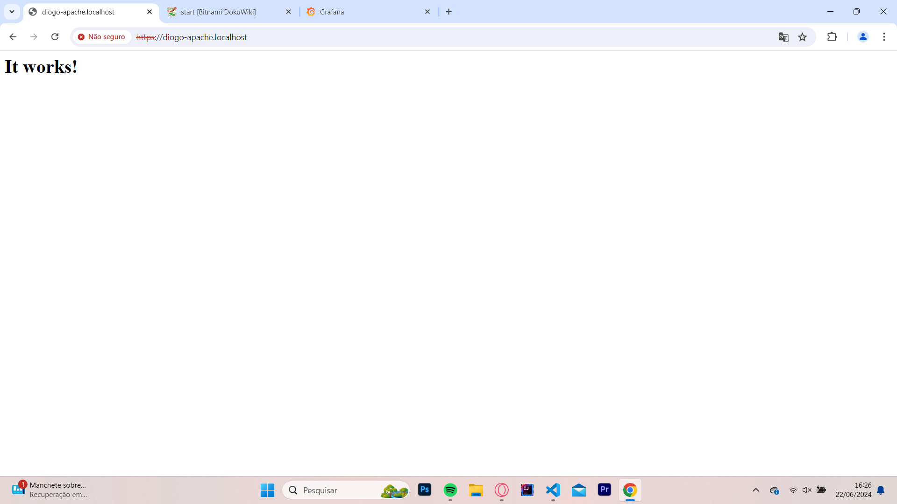
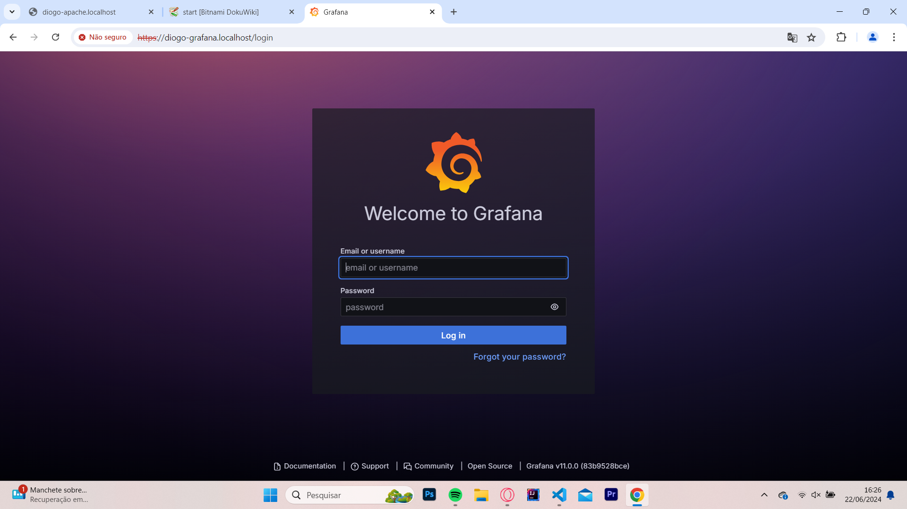
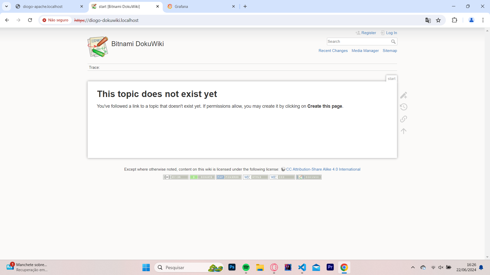
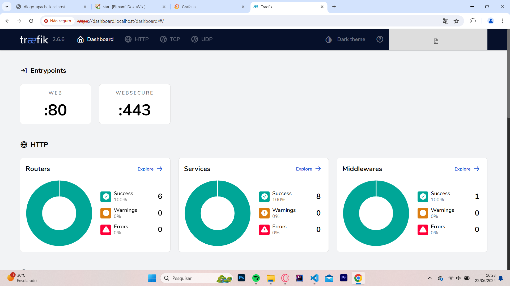

# Projeto PROXY reverso 
# (DIDÁTICO PARA O USO NAS AULAS DE REDES DE COMPUTADORES)

Utilizando o Traefik para servidor Apache, Grafana e monitoramento utilizando o dashboard próprio do Traefik.
    
Este projeto utiliza Docker facilitando a implantação (deploy) dos serviços.


#### Aluno: Artur Bazzanella Christmann
#### Professor: Felipe Vargas
#### Turma: TI23

### Sobre o trabalho

Documente com print e coloque aqui as respostas.

TODO, Documentação e Print Screm das imagens executadas no Docker.

***

## Passo a passo para configurar o ambiente Docker no Windows e Ubuntu

# 1. Windows

### 1.1. Instalar o Docker no Windows

    1.1.2 Baixe o Docker Desktop para Windows no [site oficial](https://www.docker.com/products/docker-desktop).
    1.1.3 Execute o instalador e siga as instruções na tela.
    1.1.4 Após a instalação, reinicie o computador.
    1.1.5 Abra o Docker Desktop para confirmar que ele está funcionando corretamente.

### 1.2. Configurar o arquivo `docker-compose.yaml`

  Crie um arquivo chamado `docker-compose.yaml` no diretório de sua preferência com o seguinte conteúdo:

```yaml
version: '3'
services:

  traefik:
    image: "traefik:v2.6.6"
    container_name: "traefik-network"
    command:
      - --entrypoints.web.address=:80
      - --entrypoints.websecure.address=:443
      - --providers.docker
      - --api
      - --log.level=DEBUG
      - --certificatesresolvers.letsencrypt.acme.email=arturbc@gmail.com
      - --certificatesresolvers.letsencrypt.acme.storage=/acme.json
      - --certificatesresolvers.letsencrypt.acme.tlschallenge=true
    ports:
      - "80:80"
      - "443:443"
    networks:
      - internal
      - web
    volumes:
      - "/var/run/docker.sock:/var/run/docker.sock:ro"
      - "./acme.json:/acme.json"
    labels:
      - "traefik.http.routers.traefik.rule=Host(`dashboard.localhost`)"
      - "traefik.http.routers.traefik.service=api@internal"
      - "traefik.http.routers.traefik.tls.certresolver=letsencrypt"
      - "traefik.http.routers.traefik.entrypoints=websecure"
      - "traefik.http.routers.http-catchall.rule=hostregexp(`{host:.+}`)"
      - "traefik.http.routers.http-catchall.entrypoints=web"
      - "traefik.http.routers.http-catchall.middlewares=redirect-to-https"
      - "traefik.http.middlewares.redirect-to-https.redirectscheme.scheme=https"

  apache:
    image: 'bitnami/apache:latest'
    container_name: apache-network
    ports:
      - '8080:8080'
    volumes:
      - ./app:/app
    labels:
      - traefik.http.routers.apache.rule=Host(`apache.localhost`)
      - traefik.http.routers.apache.tls=true
      - traefik.http.routers.apache.tls.certresolver=letsencrypt
      - traefik.port=8080
    networks:
      - internal
      - web
    restart: unless-stopped

  samba:
    image: dperson/samba
    container_name: samba-network
    ports:
      - '5445:445'
    environment:
      - TZ=America/Sao_Paulo
      - USERS=artur:123456
      - SHARES=Compartilhamento:/compartilhamento:r:artur
    volumes:
      - ./compartilhamento:/compartilhamento
    networks:
      - internal
    restart: unless-stopped

  db:
    image: mysql:8.3.0
    container_name: db-1
    restart: always
    environment:
      MYSQL_ROOT_PASSWORD: 123456
      MYSQL_DATABASE: database
      MYSQL_USER: artur
      MYSQL_PASSWORD: 123456
    ports:
      - "3307:3306"
    volumes:
      - ./data:/var/lib/mysql
    networks:
      - internal

  grafana:
    image: grafana/grafana:latest
    container_name: grafana
    ports:
      - "3000:3000"
    networks:
      - internal
    restart: unless-stopped

  dokuwiki:
    image: bitnami/dokuwiki:latest
    container_name: dokuwiki-1
    ports:
      - "8081:80"
    networks:
      - internal
    restart: unless-stopped

networks:
  web:
    external: true
  internal:
    external: false

```
### 1.3. Rodar os containers com Docker Compose

    1.3.1. Abra o terminal do Windows (PowerShell ou CMD).
    1.3.2. Navegue até o diretório onde você salvou o arquivo docker-compose.yaml.
    1.3.3. Execute o comando: docker-compose up -d

### 1.4. Verificar se os serviços estão rodando

Você pode verificar se os serviços estão rodando corretamente acessando os seguintes URLs no seu navegador:

  #### - Traefik Dashboard: http://dashboard.localhost
  #### - Apache: http://apache.localhost:8080
  #### - Grafana: http://localhost:3000
  #### - Dokuwiki: http://localhost:8081

# Ubuntu

### 2. Instalar o Docker no Ubuntu

##### (Para os passo a seguir utilize o terminal eexecute os comandos)

#### 2.1. Atualize a lista de pacotes:

      $ sudo apt-get update

#### 2.2. Instale os pacotes necessários:

      a. $ sudo apt-get install
      b. $ sudo apt-get ca-certificates
      c. $ sudo apt-get curl
      d. $ sudo apt-get gnupg
      e. $ sudo apt-get lsb-release

#### 2.3. Adicione a chave GPG oficial do Docker:

      $ sudo mkdir -p /etc/apt/keyrings
      $ curl -fsSL https://download.docker.com/linux/ubuntu/gpg | sudo gpg --dearmor -o /etc/apt/keyrings/docker.gpg

#### 2.4. Configure o repositório Docker:

      $ echo "deb [arch=$(dpkg --print-architecture) signed-by=/etc/apt/keyrings/docker.gpg] https://download.docker.com/linux/ubuntu
      $ (lsb_release -cs) stable" | sudo tee /etc/apt/sources.list.d/docker.list > /dev/null

#### 2.5. Instale o Docker Engine:

      $ sudo apt-get update
      $ sudo apt-get install docker-ce docker-ce-cli containerd.io docker-buildx-plugin docker-compose-plugin

#### 2.6. Verifique se a instalação foi bem-sucedida:

     $ sudo docker run hello-world

#### 2.7. Instalar o Docker Compose:

##### 2.7.1 Baixe a versão estável mais recente do Docker Compose:

     $ sudo curl -L "https://github.com/docker/compose/releases/download/2.17.3/docker-compose-$(uname -s)-$(uname -m)" -o /usr/local/bin/docker-compose

##### 2.7.2 Aplique permissões de execução ao binário:

      $ sudo chmod +x /usr/local/bin/docker-compose

##### 2.7.3 Verifique a instalação:

      $ docker-compose --version

##### 2.7.4 Configurar o arquivo docker-compose.yaml:

      2.7.4.1 Crie um arquivo chamado `docker-compose.yaml` no diretório de sua preferência com o seguinte conteúdo:

```yaml
version: '3'
services:

  traefik:
    image: "traefik:v2.6.6"
    container_name: "traefik-network"
    command:
      - --entrypoints.web.address=:80
      - --entrypoints.websecure.address=:443
      - --providers.docker
      - --api
      - --log.level=DEBUG
      - --certificatesresolvers.letsencrypt.acme.email=arturbc@gmail.com
      - --certificatesresolvers.letsencrypt.acme.storage=/acme.json
      - --certificatesresolvers.letsencrypt.acme.tlschallenge=true
    ports:
      - "80:80"
      - "443:443"
    networks:
      - internal
      - web
    volumes:
      - "/var/run/docker.sock:/var/run/docker.sock:ro"
      - "./acme.json:/acme.json"
    labels:
      - "traefik.http.routers.traefik.rule=Host(`dashboard.localhost`)"
      - "traefik.http.routers.traefik.service=api@internal"
      - "traefik.http.routers.traefik.tls.certresolver=letsencrypt"
      - "traefik.http.routers.traefik.entrypoints=websecure"
      - "traefik.http.routers.http-catchall.rule=hostregexp(`{host:.+}`)"
      - "traefik.http.routers.http-catchall.entrypoints=web"
      - "traefik.http.routers.http-catchall.middlewares=redirect-to-https"
      - "traefik.http.middlewares.redirect-to-https.redirectscheme.scheme=https"

  apache:
    image: 'bitnami/apache:latest'
    container_name: apache-network
    ports:
      - '8080:8080'
    volumes:
      - ./app:/app
    labels:
      - traefik.http.routers.apache.rule=Host(`apache.localhost`)
      - traefik.http.routers.apache.tls=true
      - traefik.http.routers.apache.tls.certresolver=letsencrypt
      - traefik.port=8080
    networks:
      - internal
      - web
    restart: unless-stopped

  samba:
    image: dperson/samba
    container_name: samba-network
    ports:
      - '5445:445'
    environment:
      - TZ=America/Sao_Paulo
      - USERS=artur:123456
      - SHARES=Compartilhamento:/compartilhamento:r:artur
    volumes:
      - ./compartilhamento:/compartilhamento
    networks:
      - internal
    restart: unless-stopped

  db:
    image: mysql:8.3.0
    container_name: db-1
    restart: always
    environment:
      MYSQL_ROOT_PASSWORD: 123456
      MYSQL_DATABASE: database
      MYSQL_USER: artur
      MYSQL_PASSWORD: 123456
    ports:
      - "3307:3306"
    volumes:
      - ./data:/var/lib/mysql
    networks:
      - internal

  grafana:
    image: grafana/grafana:latest
    container_name: grafana
    ports:
      - "3000:3000"
    networks:
      - internal
    restart: unless-stopped

  dokuwiki:
    image: bitnami/dokuwiki:latest
    container_name: dokuwiki-1
    ports:
      - "8081:80"
    networks:
      - internal
    restart: unless-stopped

networks:
  web:
    external: true
  internal:
    external: false

```

##### 2.7.5 Rodar os containers com Docker Compose

      $ docker-compose up -d


### 2.7.6 Verificar se os serviços estão rodando

Você pode verificar se os serviços estão rodando corretamente acessando os seguintes URLs no seu navegador:

  #### - Traefik Dashboard: http://dashboard.localhost
  #### - Apache: http://apache.localhost:8080
  #### - Grafana: http://localhost:3000
  #### - Dokuwiki: http://localhost:8081

# 3. Documentação com prints

#### Docker com imagem dos serviços: Apache, Grafana, Dokuwiki, Traefik, DB e Samba.

#### Resposta 1:

Docker com imagem dos serviços: Apache, Grafana, Dokuwiki, Traefik, DB e Samba.

#### Print Screem:


#### Resposta 2:

Apache.

#### Print Screem:


#### Resposta 3:

Grafana.

#### Print Screem:


#### Resposta 4:

Traefik.

#### Print Screem:


#### Resposta 5:

Dokuwiki.

#### Print Screem:


#### Resposta 6:

Samba.

#### Print Screem:


## Thanks Teacher! ;-)


 ***

 ## Implantação dos serviços
 Abrir o terminal e execute os seguintes comandos:

Construindo e excutando os serviços (pressione ctrl+c para cencelar):

 > $ docker-compose up --build

 Utilize -d para dar um "detach" rodar o serviço na máquina

> $ docker-compose up --build -d

Parando serviços: 
> $ docker-compose stop

Removendo serviços: 
> $ docker-compose rm
***

 ## Testando os serviços

Utilize o navegador web e digite a seguinte url:

> http://apache.localhost

  

 > http://grafana.localhost

  

  > http://dashboard.localhost

  

  > http://dashboard.localhost

  
